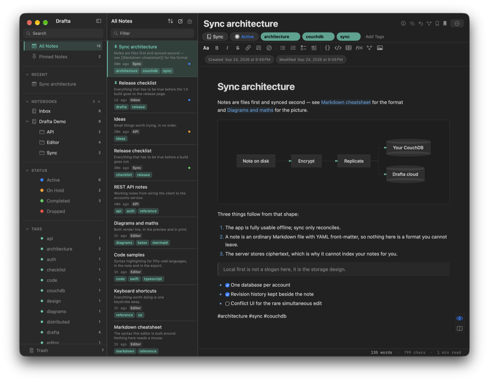
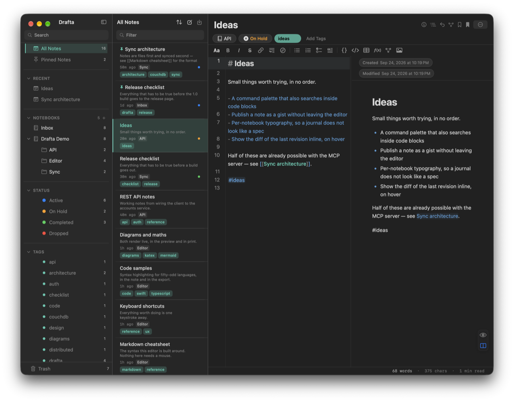
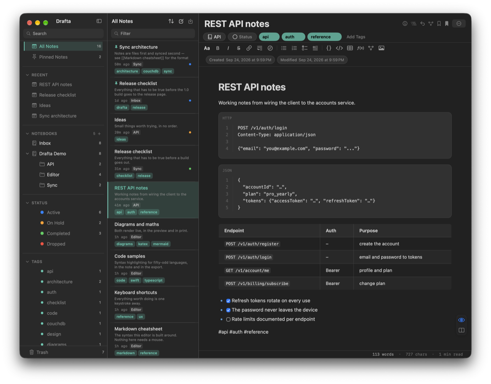
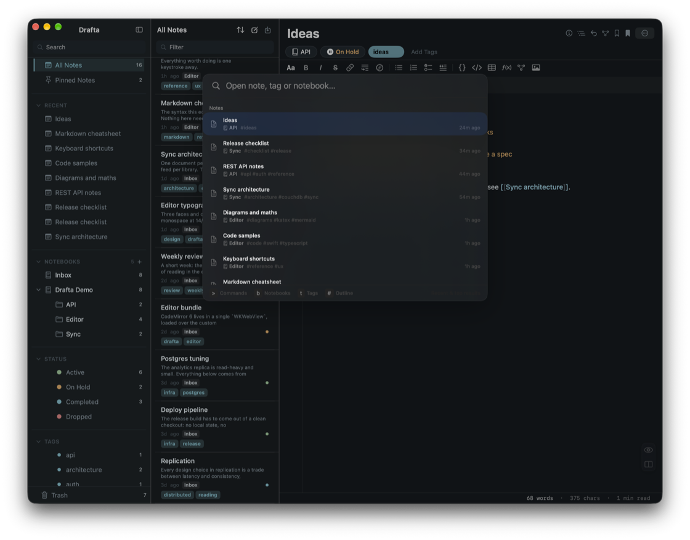
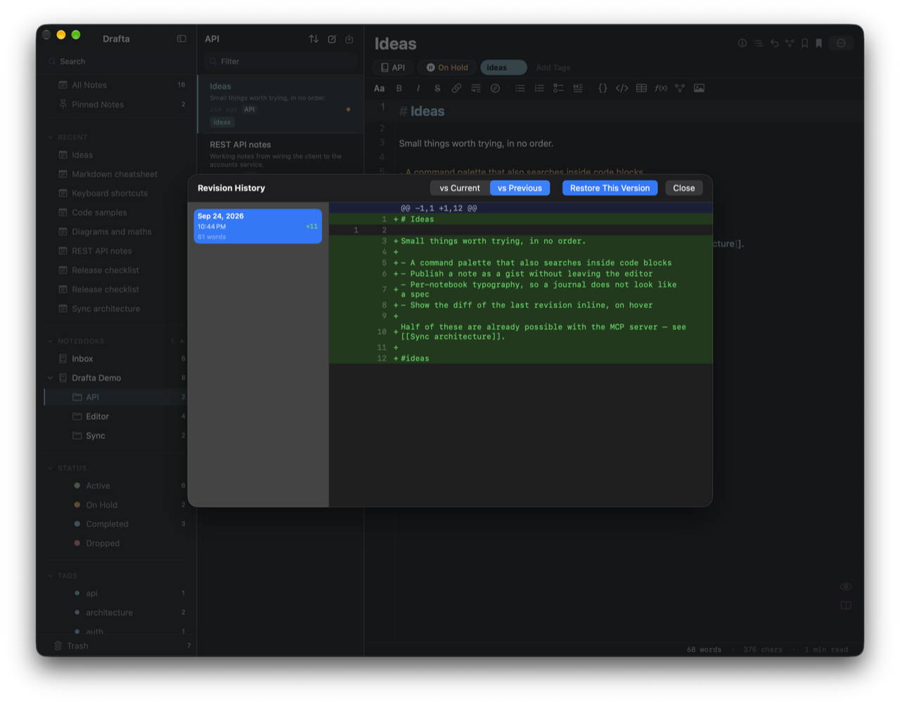

# Drafta

**A Markdown editor for programmers, native on macOS. Every note stays a plain `.md` file on your Mac.**

## Download

### [Download Drafta 1.0 for macOS →](https://github.com/rpegorov/drafta-releases/releases/latest)

macOS 26 or later · Apple Silicon and Intel · the DMG is on the [latest release](https://github.com/rpegorov/drafta-releases/releases/latest) page.

## Why Drafta

- **Native, not Electron.** Swift and SwiftUI, with CodeMirror 6 in a WebKit view. A real Mac app with no bundled browser engine.
- **Your notes are files.** One Markdown file per note, YAML front-matter for tags and status. `grep` them, commit them to git, open them in VS Code or Obsidian.
- **Editor, preview, or both.** Three view modes one click apart, split with synchronised scrolling. Mermaid and KaTeX render live, tables get a grid picker, code blocks highlight 50+ languages.
- **A library you can steer.** Notebooks nest without limit. Tags are pulled from the text automatically, each can carry a colour. Notes hold a status: Active, On Hold, Completed, Dropped.
- **Everything a keystroke away.** `⌘P` is fuzzy search across every note, tag and notebook.
- **History you can read.** Up to 30 revisions per note, stored on your disk, with a unified diff and one-click restore.
- **An assistant and an MCP server.** `⌘J` opens the assistant with your own API key (Anthropic, OpenAI or DeepSeek; keys live in the macOS Keychain). The built-in MCP server gives Claude and other MCP clients 12 tools over your library, or runs read-only.
- **In and out on your terms.** Import `.md` and `.html` (Bear format). Export to PDF, DOCX, HTML or Markdown. Eleven themes ship, and a JSON theme of your own drops straight in.

## A closer look

*Split mode: your Markdown on the left, the rendered note on the right.*

*Code blocks with syntax highlighting and tables, rendered as you write.*

*`⌘P` opens any note, tag or notebook by a few letters.*

*Every revision kept on disk, compared as a diff, restored in one click.*

## Pricing

- Every new account starts with a **30-day free trial**. No card is needed.
- One plan with everything in it, billed monthly or yearly. No feature tiers.
- **Card payment is not connected yet, so nothing is charged today.**
- When the trial ends, Drafta turns read-only until you pick a plan: every note stays on your Mac and stays readable.

Current details: [drafta.org](https://drafta.org/#pricing).

## Install

1. Download `Drafta-1.0.dmg` from the [latest release](https://github.com/rpegorov/drafta-releases/releases/latest).
2. Open it and drag **Drafta.app** into **Applications**.
3. The build is self-signed and not notarised yet, so macOS blocks the first launch. Open **System Settings → Privacy & Security**, find the message about Drafta, click **Open Anyway** and confirm. macOS asks only once.

After that, updates arrive in the app. Sparkle checks once a day, or on demand from **Drafta → Check for Updates…**, and every update is verified with an EdDSA signature before it installs.

Drafta needs an account: it starts your trial, carries your plan and, unless you connect your own CouchDB, keeps an encrypted cloud copy of your notes.

## Privacy

- **On your Mac: ordinary Markdown.** The library is plain `.md` files with revisions in a folder beside them. No proprietary database. FileVault protects the disk.
- **In the cloud: ciphertext.** Notes are sealed with AES-256-GCM on your Mac before they are sent, under a key derived from your library password with PBKDF2-HMAC-SHA256. The service never holds the key.
- **Two passwords, two jobs.** The account password signs you in. The library password never leaves your Mac, so nobody can reset it for you.
- **Your choice of storage.** Sync to your Drafta account, or connect your own CouchDB, locally or on a server you control, with no quota.

## Links

- Website: [drafta.org](https://drafta.org)
- Support: [support@drafta.org](mailto:support@drafta.org)
- Releases: [all versions](https://github.com/rpegorov/drafta-releases/releases)

Drafta is licensed under Apache-2.0. Made by Rostislav Egorov · craftzman.
